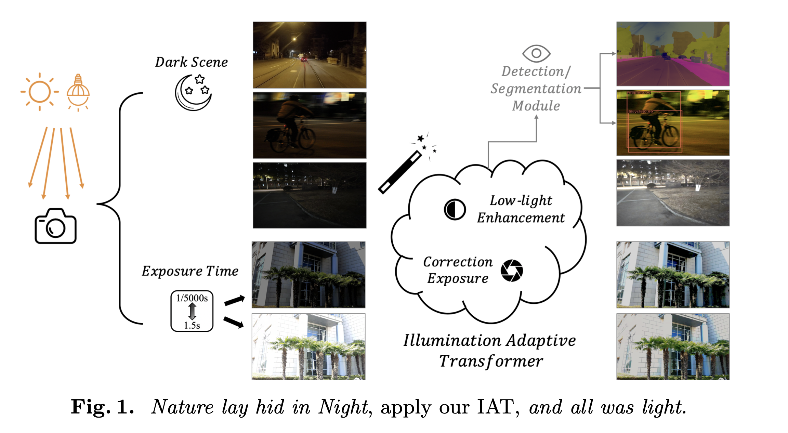

# Illumination Adaptive Transformer (IAT)

Vision Tasks for Both **Human Vision** and **Machine Vision**

**5 Tasks Under Various Lighting Conditions**: Low-light Enhancement ([LOL](https://daooshee.github.io/BMVC2018website/), [MIT5K](https://data.csail.mit.edu/graphics/fivek/)) // [Exposure Correction](https://github.com/mahmoudnafifi/Exposure_Correction) // [Low-Light Object Detection](https://arxiv.org/abs/1805.11227) // [Low-Light Semantic Segmentation](https://openaccess.thecvf.com/content/ICCV2021/html/Sakaridis_ACDC_The_Adverse_Conditions_Dataset_With_Correspondences_for_Semantic_Driving_ICCV_2021_paper.html) // [Various-Light Object Detection](https://bop.felk.cvut.cz/home/)

<!--  -->

  

  Figure 1: IAT (illumination-adaptive-transformer) on multiply light vision challenges.

