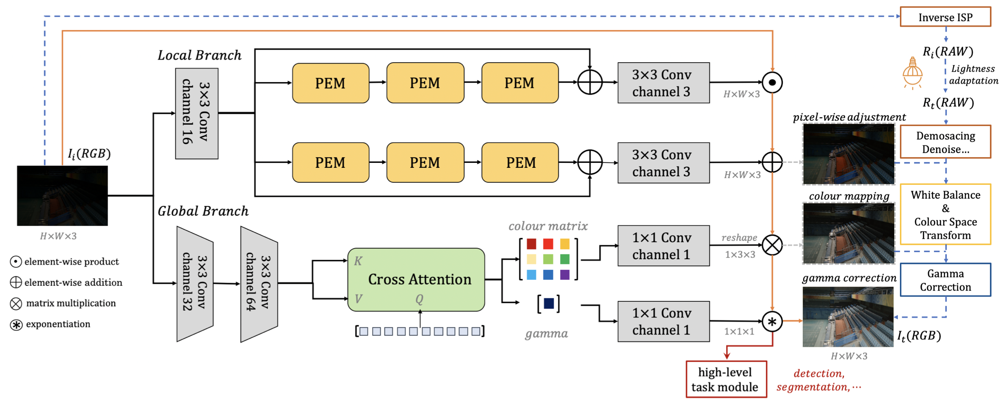

# <font color=red>Illumination</font> <font color=green>Adaptive</font> <font color=blue>Transformer</font> (IAT) [(paper)](https://arxiv.org/abs/2205.14871) 

**2022.7.11:** Upload the object detection code. See [detection](https://github.com/cuiziteng/Illumination-Adaptive-Transformer/tree/main/IAT_high/IAT_mmdetection).

## Illumination Adaptive Transformer

For Vision Tasks under various lighting conditions, towards both **Human Vision** :smile:  and **Machine Vision** :camera: 

**5 Tasks Under Various Lighting Conditions**: 1. Low-light Enhancement (LOL, MIT5K) // 2. [Exposure Correction](https://github.com/mahmoudnafifi/Exposure_Correction) // 3. [Low-Light Object Detection](https://arxiv.org/abs/1805.11227) // 4. [Low-Light Semantic Segmentation](https://openaccess.thecvf.com/content/ICCV2021/html/Sakaridis_ACDC_The_Adverse_Conditions_Dataset_With_Correspondences_for_Semantic_Driving_ICCV_2021_paper.html) // 5. [Various-Light Object Detection](https://bop.felk.cvut.cz/home/)

<!--  -->
<div align="center">
  
</div>
<p align="center">
  Figure 1: IAT (illumination-adaptive-transformer) for multi light conditions vision tasks.
</p>


## Model Structure:

<!--  -->
<div align="center">
  
</div>
<p align="center">
  Figure 2: Model Structure of Illumination Adaptive Transformer.
</p>

Our IAT model consist of two individual branches, the local branch is for pixel-wise adjustment and ouputs two feature map for add and multiply. The global branch is for global-wise adjustment and outpus the color matrix and gamma value, global branch is inspired by [DETR](https://github.com/facebookresearch/detr), the network would updates color matrix and gamma value by a dynamic query learning way. BTW, the total model is only over **90k+** parameters and the inference speed is only **0.004s** per image on LOL dataset.

## Usage:

Enviroment (install pytorch 1.7.1 or later, following [pytorch](https://pytorch.org/).):
```
$ conda install --yes -c pytorch pytorch=1.7.1 torchvision cudatoolkit=11.0
$ pip install timm,matplotlib,IQA_pytorch,tqdm,
```

For low-level vision (low-light enhancement, exposure correction):
```
cd IAT_enhance
```

For high-level vision (low-light detection, low-light semantic segmentation):
```
cd IAT_high
```

## Citation:

Detection and Segmentation are use [mmdetection](https://mmdetection.readthedocs.io/en/latest/) and [mmsegmentation](https://mmsegmentation.readthedocs.io/en/latest/), some of the code are borrow from [Zero-DCE](https://github.com/Li-Chongyi/Zero-DCE) and [UniFormer](https://github.com/Sense-X/UniFormer), thanks them both so much!

Citation:
```
@misc{Illumination_Adaptive_Transformer,
  doi = {10.48550/ARXIV.2205.14871},
  url = {https://arxiv.org/abs/2205.14871},
  author = {Cui, Ziteng and Li, Kunchang and Gu, Lin and Su, Shenghan and Gao, Peng and Jiang, Zhengkai and Qiao, Yu and Harada, Tatsuya},
  keywords = {Computer Vision and Pattern Recognition (cs.CV), FOS: Computer and information sciences, FOS: Computer and information sciences},
  title = {Illumination Adaptive Transformer},
  publisher = {arXiv},
  year = {2022},
  copyright = {Creative Commons Attribution 4.0 International}
}
```

We also have another work about the **low-light object detection**, **ICCV 2021**: Multitask AET with Orthogonal Tangent Regularity for Dark Object Detection [(code)](https://github.com/cuiziteng/ICCV_MAET) [(paper)](https://openaccess.thecvf.com/content/ICCV2021/papers/Cui_Multitask_AET_With_Orthogonal_Tangent_Regularity_for_Dark_Object_Detection_ICCV_2021_paper.pdf), please read if you interest!

